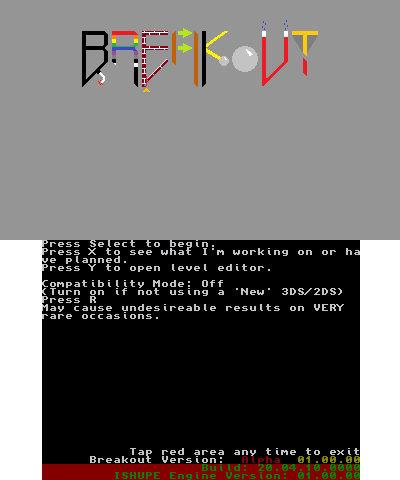
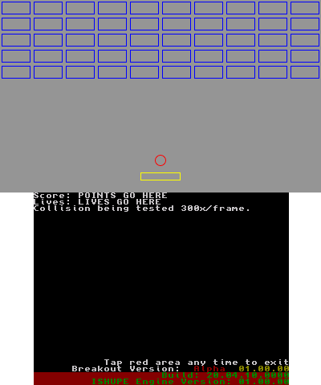
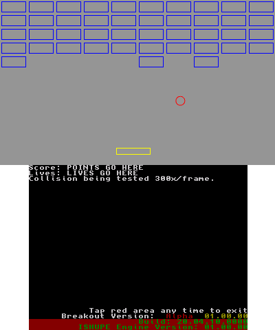

# Breakout Redux
A Breakout clone for the 3DS (Using ctrulib and citro3d/2d)  
A complete rewrite of my previous attempt: [Breakout](https://github.com/Magicrafter13/Breakout)

-Written by Magicrafter13 (Matthew Rease).

The code is tested in the Citra emulator, and sometimes tested on real hardware.  
Current status of repository code:  

### Screenshots

  

# Play

Barely in a playable state (still in Alpha), however press start on the title screen to begin, then press select to launch the ball. Use Left/Right to move the paddle.  
To play this, just download a precompiled binary (3dsx, cia, or elf) from the releases tab.

## Controls

#### Current Testing Controls ####  
* __D-Pad Left/Right__ (Hold) Moves the paddle left or right, respectively
* __D-Pad Up/Down__ Adds or Subtracts 1 degree from the ball's angle, respectively
* __L and R__ (Hold) Subtacts or Adds 0.5 degrees to the ball's angle, respectively
* __X and B__ Adds or Subtracts 5 from the ball's y coordinate, respectively
* __Y and A__ Subtracts or Adds 5 degrees to the ball's angle, respectively
* __Select__ Launch ball
* __Start__ Return (to previous screen, ie: title screen, or level designer)

#### In - Game ####  
* __D-Pad__ or Joystick to move Left and Right
* __A Button__ to launch ball (when ball attached) or shoot laser if power up has been acquired.
* __Select__ to start game (or return to title)
* __Y__ to open Level editor
* __Start__ to exit

#### In - Level Editor ####  
* __D-Pad__ or __Joystick__ to move cursor
* __L__/__R__, __ZL__/__ZR__ or __Y__/__X__ to switch brick type
* __B__ return to title
* __Start__ play your level

## "Nightlies"  
(Not currently available)  
Available on my website. [Click Here!](https://oldforgeinn.ddns.net/)

# Edit / self-compile  
To compile this game, you shouldn't need to install anything extra, as long as you have libctru and citro3d (and citro2d) it should work, if not make sure to tell me.  
You will need [bannertool.exe](https://github.com/Steveice10/bannertool/releases) to create the smdh file.  
In the BreakoutRedux subfolder, run `make` to compile the game.

If you want to create the CIA file, to install the game to your system launcher, you will need [makerom.exe](https://github.com/jakcron/Project_CTR).  
In the BreakoutRedux subfolder, run `make cia` to create the cia file.

If you're on Linux, I'm not entirely sure how it works, though I'm fairly certain there are Linux versions of bannertool and makerom.
